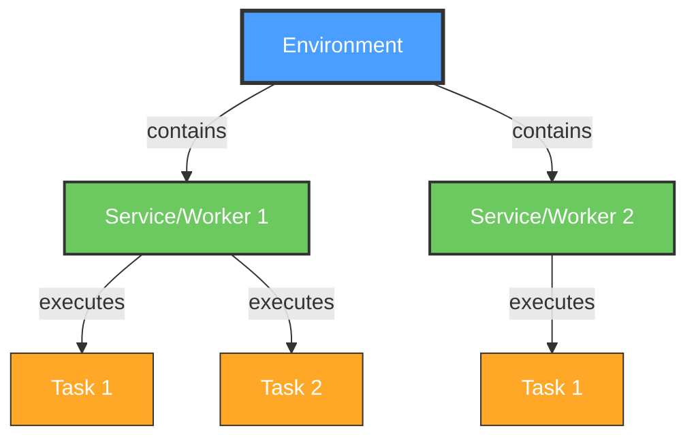

# Fiji and Python

## Scripting, Environments, and Deep Learning Integration

Curtis Rueden @ UW-Madison LOCI  
I2K×BINA 2026

<div class="pt-12">
  <span @click="$slidev.nav.next" class="px-2 py-1 rounded cursor-pointer" hover="bg-white bg-opacity-10" style="font-size: 2em">
    Press <kbd style="font-size: 1em">Space</kbd> to begin <carbon:arrow-right class="inline"/>
  </span>
</div>

<div class="pt-12 text-sm opacity-75">

**SLIDES:** `https://fiji.github.io/i2k-2026-fiji-python/`

</div>

<!--
AGENDA / TIMING (120 min):
- 0:00–0:25  Five steps toward simplicity (talk)
- 0:25–0:35  What's new in Appose
- 0:35–0:50  Demos: Appose in the wild
- 0:50–1:30  Hands-on: UNSEG as an appose-python script
- 1:30–1:52  One more step: scikit-ops
- 1:52–2:00  Which approach when? + Q&A
-->

---
layout: default
---

# Today's Plan

<div class="grid grid-cols-2 gap-8">
<div>

| | |
|---|---|
| **0:00** | Five steps toward simplicity |
| **0:25** | What's new in Appose |
| **0:35** | Demos: Appose in the wild |
| **0:50** | 👩‍💻 Hands-on: a Python-powered Fiji script |
| **1:30** | One more step: scikit-ops |
| **1:52** | Which approach when? Q&A |

</div>
<div>

<v-click>

**To follow along with the hands-on:**
- Fiji **Latest** (not Stable) from https://fiji.sc/
- *Help › Update...* until fully up to date
- [pixi](https://pixi.sh/latest/installation/) (recommended)
- git (recommended)

**Can follow along without coding&mdash;just watch!**

</v-click>

</div>
</div>

---
layout: default
---

# The Problem

<div class="grid grid-cols-2 gap-8">
<div>

### Innovation happens in Python 🐍

- Cellpose, StarDist, SAM, Trackastra, nnInteractive...
- PyTorch, TensorFlow, JAX
- New tools every week

</div>
<div>

### Biologists work in Fiji 🔬

- Established, familiar workflows
- Point-and-click, macros, scripts
- Huge plugin ecosystem

</div>
</div>

<v-click>

<div class="pt-8">

### And every Python tool wants its *own* environment 😱

```
cellpose 3   → torch 2.x, numpy 2.x, python 3.10+
stardist     → tensorflow <2.16, numpy <2, python 3.9–3.11
UNSEG        → python 3.9, numpy 1.24.3, scikit-image 0.20.0
```

</div>

</v-click>

---
layout: center
class: text-center
---

# Five Steps Toward Simplicity

How do we get Python into Fiji, and make it *easy*?

---
layout: default
---

# The Staircase

<div class="text-sm">

| | Approach | You write | Environment | Processes | Platform |
|---|---|---|---|---|---|
| <v-click at="1">**1**</v-click> | <v-click at="1">Call Python via `ProcessBuilder`</v-click> | <v-click at="1">Java + Python + glue</v-click> | <v-click at="1">*You* install it</v-click> | <v-click at="1">Two, via files</v-click> | <v-click at="1">Fiji</v-click> |
| <v-click at="2">**2**</v-click> | <v-click at="2">**Python mode** (PyImageJ)</v-click> | <v-click at="2">Python script</v-click> | <v-click at="2">*You* pick one</v-click> | <v-click at="2">**One**, shared memory</v-click> | <v-click at="2">Fiji</v-click> |
| <v-click at="3">**3**</v-click> | <v-click at="3">**Appose**-powered plugins</v-click> | <v-click at="3">Java + Python</v-click> | <v-click at="3">Built on demand</v-click> | <v-click at="3">Many, shared memory</v-click> | <v-click at="3">Fiji</v-click> |
| <v-click at="4">**4**</v-click> | <v-click at="4">**appose-python** scripts</v-click> | <v-click at="4">Python script</v-click> | <v-click at="4">Built on demand</v-click> | <v-click at="4">Many, shared memory</v-click> | <v-click at="4">Fiji</v-click> |
| <v-click at="5">**5**</v-click> | <v-click at="5">**scikit-ops**</v-click> | <v-click at="5">A Python *function*</v-click> | <v-click at="5">Built on demand</v-click> | <v-click at="5">Many, shared memory</v-click> | <v-click at="5">**Any**</v-click> |

</div>

<v-click at="6">

<div class="pt-4">

Each step asks **less** of the author, and **nothing** of the user. 🎯

</div>

</v-click>

---
layout: two-cols
---

# ① Do It Yourself

Fiji has always been able to *launch* Python...

```groovy
#@ ImagePlus imp
import ij.IJ

// Save the image to disk.
input = File.createTempFile("in", ".tif")
IJ.saveAsTiff(imp, input.path)
output = new File(input.parent, "out.tif")

// Run Python in some environment... somewhere.
pb = new ProcessBuilder(
  "/home/me/miniforge3/envs/seg/bin/python",
  "/home/me/scripts/segment.py",
  input.path, output.path)
pb.inheritIO()
pb.start().waitFor()

// Read the result back from disk.
IJ.openImage(output.path).show()
```

::right::

<div class="pl-8 pt-16">

<v-clicks>

### Cons ❌
- **User** must install Python + all dependencies
- Hardcoded paths everywhere
- Data copied through the filesystem
- No progress, no cancelation, errors = exit codes
- Doesn't travel to another computer

### Pros ✅
- Works! (Sort of.)
- Environments are isolated 🤔

</v-clicks>

</div>

---
layout: two-cols
---

# ② Python Mode

Real CPython *inside* Fiji's process

Powered by **PyImageJ**, **scyjava** (JPype), and **Jaunch**

*Edit › Options › Python...* → choose an environment → restart

```python
#@ ImageJ ij
#@ Dataset image
#@ double sigma
#@output Dataset blurred

from skimage.filters import gaussian

arr = ij.py.from_java(image)  # no copy!
blurred = ij.py.to_dataset(gaussian(arr, sigma))
```

::right::

<div class="pl-8 pt-16">

<v-clicks>

### Pros ✅
- **Same process**: Java and Python share memory directly
- Java objects wrapped as Python objects: full ImageJ API from Python
- Interactive, low latency, no serialization

### Cons ❌
- **One environment** at a time, chosen by the user
- Everything must coexist: Fiji's JVM + every Python library
- A crash in native code takes down Fiji

</v-clicks>

</div>

<!--
Emphasize: this is not obsoleted by what follows. It's a different animal.
We'll come back to "which one when" at the end.
-->

---
layout: default
---

# ③ Appose

## "Interprocess cooperation with shared memory"

<v-clicks>

- 🔄 **Interprocess** - Multiple processes connected via a communication protocol
- 🤝 **Cooperation** - Build environments, start services, run tasks
- 💾 **Shared Memory** - Cross-platform, cross-language memory buffers

</v-clicks>

<v-click>

<div class="pt-6">

Java ↔ Python, Python ↔ Python, Java ↔ Groovy, ... **each tool in its own environment**, all at once.

Environments via **pixi**, **uv**, or **micromamba**&mdash;downloaded and built on demand.
**User doesn't need to know any of them exist.**

</div>

</v-click>

<div class="pt-6 text-sm opacity-75">

https://apposed.org &nbsp;·&nbsp; Deep dive: [I2K 2025 Appose workshop](https://fiji.github.io/i2k-2025-appose/)

</div>

---
layout: default
---

# Appose: Environment → Service → Task

<div class="absolute right-10" style="top: 8rem; width: 22rem;">



</div>

<div style="width: 55%">

```java
// 1. Build the environment (first time only).
Environment env = Appose.file("pixi.toml")
    .subscribeProgress((title, cur, max) -> ...)
    .build();

// 2. Start a worker process in it.
try (Service python = env.python()) {

    // 3. Run a task: inputs in, outputs out.
    Map<String, Object> inputs = Map.of(
        "image", ShmImg.copyOf(img).ndArray());
    Task task = python.task(script, inputs)
        .listen(e -> log(e.message))
        .waitFor();

    Img<?> labels = NDArrays.asArrayImg(
        (NDArray) task.outputs.get("labels"));
}
```

</div>

---
layout: default
---

# Shared Memory: No Copying Big Images

`NDArray` = named `SharedMemory` block + dtype + shape

<div class="grid grid-cols-2 gap-4 pt-4">
<div>

### Python: NumPy-compatible

```python
import appose

data = appose.NDArray("uint16", [2, 20, 25])
arr = data.ndarray()  # numpy view, no copy
```

</div>
<div>

### Java: ImgLib2-compatible

```java
import net.imglib2.appose.*;

// View an NDArray from Python as an Img.
ShmImg<FloatType> img = new ShmImg<>(ndarray);

// Or put an existing Img into shared memory.
Img<FloatType> shared = ShmImg.copyOf(someImg);
```

</div>
</div>

<v-click>

<div class="pt-6">

**Result:** Both processes see *the same pixels*&mdash;only the metadata travels as JSON.

</div>

</v-click>

---
layout: default
---

# In-Process vs. Interprocess: Complementary!

<div class="text-sm">

| | **Python mode** (in-process) | **Appose** (interprocess) |
|---|---|---|
| Environments | One, chosen by user | Many, isolated, built on demand |
| Incompatible tools together | ❌ | ✅ |
| Access to Java objects | ✅ Direct, full API | ⚠️ Via serialization or proxies |
| Data sharing | ✅ Anything, zero-copy | ✅ Arrays zero-copy; rest as JSON |
| Crash isolation | ❌ Crash takes down Fiji | ✅ Worker dies, Fiji lives |
| Cancelation | ⚠️ Cooperative only | ✅ Cooperative, or kill the worker |
| Startup cost | ✅ None after launch | ⚠️ Worker process start (+ first build) |
| Best for | **Interactive** scripting against the ImageJ API | **Shipping** Python tools to users |

</div>

<v-click>

<div class="pt-4">

Python mode is **not obsolete**. It's a different animal: use the right one for the job. 🐘 ≠ 🐙

</div>

</v-click>

---
layout: two-cols
---

# ③ Appose, in Practice

Appose-powered Fiji plugins, written in Java:

- **SAMJ**: Segment Anything, one click
- **TrackMate**: deep learning detectors
- **Mastodon**: Cellpose + Trackastra
- **Appose Playground** *(new!)*: Cellpose, DeXtrusion, nnInteractive, Big-FISH

<v-click>

<div class="pt-4">

But look at what a plugin author writes:
- Java code to build the env
- Java code to marshal inputs/outputs
- Java code to start/stop services
- Python code adapted to Appose's `task`
- ...*plus* the actual algorithm

</div>

</v-click>

::right::

<v-click>

<div class="pl-8 pt-16">

### Consolidating the boilerplate 🧹

Since the Pasteur hackathon (Mar 2026), we're pulling the shared plumbing out of each plugin:

- `imglib2-appose`: Img ↔ NDArray
- Common environment building & progress UI
- **appose-swing** *(coming soon)*: see what Appose is doing under the hood

**But what if there were *no* Java at all?** 🤔

</div>

</v-click>

<!--
TODO: Update the appose-swing line depending on release status before the workshop.
-->

---
layout: two-cols
---

# ④ appose-python Scripts

Write **pure Python** in Fiji's Script Editor

```python
#!appose-python
#@script(env="pixi.toml")

#@ Img image
#@ double sigma
#@output Img blurred

from scipy.ndimage import gaussian_filter

print(f"Blurring image of shape {image.shape}")
blurred = gaussian_filter(image, sigma)
```

<div class="pt-2 text-sm">

Env file: `pixi.toml`, `environment.yml`,<br>`requirements.txt`, or `pyproject.toml`

</div>

::right::

<div class="pl-8 pt-16">

<v-clicks>

- `#!appose-python` → CPython via Appose (not Jython!)
- `#@script(env=...)` → Appose builds the env on first run, reuses it after
- `#@` parameters → the usual Fiji dialog, macro recording, batch mode
- Images arrive as **NumPy arrays** via shared memory
- Output NumPy arrays go back to Fiji as images
- `print` goes to the Script Editor console
- Tracebacks point at **your** line numbers

</v-clicks>

<v-click>

**Zero lines of Java.** 🎉

</v-click>

</div>

---
layout: two-cols
---

# ⑤ scikit-ops

A standard, type-annotated Python **function** + one decorator

```python
from skop import op
from skop.types import ImageData, LabelsData

@op(env="skimage")
def otsu(
    image: ImageData,
    invert: bool = False,
) -> LabelsData:
    """Threshold an image by Otsu's method."""
    from skimage import filters, measure

    t = filters.threshold_otsu(image)
    mask = image <= t if invert else image > t
    return measure.label(mask)
```

::right::

<div class="pl-8 pt-16">

<v-clicks>

- **No platform** in the code: no Fiji, no napari
- Types → GUI widgets; docstring → tooltips
- `ImageData`, `LabelsData`, ... → *roles*: each front end shows them its own way
- `env=` → named environment, built on demand, shared between ops

</v-clicks>

<v-click>

### Run it anywhere, as is

- **Directly**: `otsu(my_array)`
- **Isolated**: `skop.Runner().run(otsu, image=a)`
- **napari**: *Plugins › scikit-ops › Ops*
- **Fiji**: *Plugins › scikit-ops › Threshold › Otsu*
- **Icy**: planned

</v-click>

</div>

<!--
Started at the naPLari hackathon in Krakow, July 2026, with Brian Northan.
TODO: Adjust Fiji bullet depending on skop-fiji release status.
-->

---
layout: default
---

# The Staircase, Revisited

<div class="grid grid-cols-5 gap-2 pt-8 text-center text-sm">

<div class="p-3 rounded" style="background: rgba(255,255,255,0.05); margin-top: 8rem">

**1. DIY**<br>
ProcessBuilder<br>
*you do everything*

</div>
<div class="p-3 rounded" style="background: rgba(255,255,255,0.08); margin-top: 6rem">

**2. Python mode**<br>
one process<br>
*one environment*

</div>
<div class="p-3 rounded" style="background: rgba(255,255,255,0.11); margin-top: 4rem">

**3. Appose plugins**<br>
many environments<br>
*Java + Python*

</div>
<div class="p-3 rounded" style="background: rgba(255,255,255,0.14); margin-top: 2rem">

**4. appose-python**<br>
many environments<br>
*pure Python script*

</div>
<div class="p-3 rounded" style="background: rgba(255,255,255,0.17)">

**5. scikit-ops**<br>
many environments<br>
*pure Python function,<br>any platform*

</div>

</div>

<div class="pt-8 text-center">

Today's hands-on climbs from **③ → ④**, then peeks at **⑤**. 🧗

</div>

---
layout: center
class: text-center
---

# What's New in Appose

Since I2K 2025

---
layout: default
---

# Releases

<div class="grid grid-cols-2 gap-8">
<div>

### appose-java

| Version | Date |
|---|---|
| 0.10.0 | Feb 2026 |
| 0.11.0 | Mar 2026 |
| 0.12.0 | *Sep 2026* |

</div>
<div>

### appose-python

| Version | Date |
|---|---|
| 0.10.0 | Feb 2026 |
| 0.11.0 | Mar 2026 |
| 0.12.0 | Jul 2026 |

</div>
</div>

<v-click>

<div class="pt-6">

**Java and Python APIs now aligned** method-for-method: learn one, you know the other.

</div>

</v-click>

<!--
TODO: Confirm appose-java 0.12.0 release date (required by scripting-appose-python).
-->

---
layout: default
---

# Better Feedback While Building Environments

<div class="grid grid-cols-2 gap-8">
<div>

<v-clicks>

- **Real progress** from pixi installs, with real denominators
- Phases: *Solving* → *Installing conda packages* → *Downloading/Installing PyPI packages* → *Done*
- **Skips redundant rebuilds**: unchanged env = instant start
- `APPOSE_ENVS_DIR` to put environments wherever you like
- **Named pixi environments**: one `pixi.toml`, several envs (e.g. `cpu` / `cuda`)
- Build from any source: `Appose.file(...)`, `.url(...)`, `.content(...)`, with format auto-detected

</v-clicks>

</div>
<div>

<v-click>

```java
Environment env = Appose.file("pixi.toml")
    .subscribeProgress((title, cur, max) ->
        status.showStatus(cur, max, title))
    .subscribeOutput(System.out::print)
    .subscribeError(System.err::print)
    .build();

// Pick a named pixi environment.
Environment gpu = env.activate("cuda");
```

</v-click>

</div>
</div>

---
layout: default
---

# More Robust Tasks

<div class="grid grid-cols-2 gap-8">
<div>

### Execution & cancelation

<v-clicks>

- Interrupting the calling thread **shuts down** the worker cleanly
- `Task.waitFor()` **throws** `TaskException` on failure: no silent errors
- Fixed race conditions around worker thread death
- Cleaner worker processes: stray conda/mamba activation variables stripped
- Windows fixes: paths with parentheses, exec handling

</v-clicks>

</div>
<div>

### Beyond primitives

<v-clicks>

- **Automatic proxies** for non-serializable outputs: call methods on remote Python objects from Java
- **Extensible encoding/decoding**: teach Appose your own types
- Pass alternate arguments to the Python service

</v-clicks>

<v-click>

```java
WorkerObject model = (WorkerObject)
    task.outputs.get("model");
model.call("eval");
```

</v-click>

</div>
</div>

---
layout: default
---

# Coming Soon: appose-swing 👀

Visual feedback for what Appose is doing under the hood

<div class="grid grid-cols-2 gap-8 pt-4">
<div>

- Which environments exist, and their build status
- Which workers are running, and their tasks
- Live build & task progress
- Reusable across Appose-based Fiji plugins

</div>
<div>

<!-- TODO: screenshot of appose-swing -->

<div class="p-8 rounded text-center opacity-50" style="border: 2px dashed currentColor">

*screenshot / live demo*

</div>

</div>
</div>

<!--
TODO: Update or drop this slide depending on appose-swing release status.
Feature bullets are placeholders; replace with what actually ships.
-->

---
layout: center
class: text-center
---

# Demos: Appose in the Wild

---
layout: default
---

# Appose-Powered Fiji Plugins

<div class="grid grid-cols-3 gap-6 pt-4">

<div>


### SAMJ
Segment Anything, one click

*Manage Update Sites › SAMJ*

</div>
<div>


### TrackMate
Deep learning spot detectors

[v9-appose branch](https://github.com/trackmate-sc/TrackMate/tree/v9-appose)

</div>
<div>


### Mastodon
Cellpose3 + Trackastra lineages

*Manage Update Sites › Mastodon-DeepLineage*

</div>
</div>

<div class="pt-8 text-sm opacity-75">

Full demo walkthroughs: [I2K 2025 Appose workshop](https://fiji.github.io/i2k-2025-appose/)

</div>

<!--
TODO: Check current TrackMate appose status (still v9-appose branch?).
Keep this brief: ~5 min total. The abstract promises these.
-->

---
layout: default
---

# New: Appose Playground 🎪

Fruits of the **Appose hackathon at Institut Pasteur** (Mar 2026)

*Help › Update... › Manage Update Sites › Appose-Playground*

<div class="grid grid-cols-2 gap-6 pt-4">
<div>

### Fiji-Cellpose
Cell/nuclei segmentation with Cellpose

### DeXtrusion
Detect cellular events in epithelia movies

</div>
<div>

### nnInterAppose
Semi-automatic 3D segmentation from manual prompts, with nnInteractive

### Big-FISH
smFISH spot detection

</div>
</div>

<div class="pt-6 text-sm opacity-75">

https://github.com/Image-Analysis-Hub#appose-playground

</div>

<!--
TODO: Pick 1–2 of these for live demo; pre-build envs on the demo machine!
TODO: Verify Big-FISH description (BigFish_Appose on update site, not yet listed on GitHub page).
-->

---
layout: center
class: text-center
---

# 👩‍💻 Hands-On 👨‍💻

**UNSEG in Fiji, the 2026 way**

<div class="pt-4">
Goal: Integrate UNSEG with Fiji as an appose-python script
</div>

<div class="pt-8 text-sm opacity-75">
⏱️ ~40 minutes
</div>

---
layout: default
---

# Workshop Overview

<div class="grid grid-cols-2 gap-8">
<div>

## What we'll build

A Fiji command that runs **UNSEG** nucleus + cell segmentation

**UNSEG:** Unsupervised segmentation of cells and their nuclei in tissue  
https://github.com/uttamLab/UNSEG

<v-click>

## Last year vs. this year

Same algorithm, same result:<br>**15 steps** of Python + Groovy + Appose API<br>→ **6 steps**, pure Python

</v-click>

</div>
<div>

<v-click>

## Why UNSEG?

- Pure CPU: no GPU, no multi-GB PyTorch download over conference Wi-Fi
- *Very* particular environment: Python 3.9, numpy 1.24.3, scikit-image 0.20.0...
- ...which would **never** coexist with a modern Fiji Python mode env

</v-click>

</div>
</div>

---
layout: default
---

# Step 0: Set Up

Create a project folder and get UNSEG:

```bash
mkdir ~/Desktop/unseg-fiji
cd ~/Desktop/unseg-fiji
git clone https://github.com/uttamLab/UNSEG
cp UNSEG/unseg.py .
unzip UNSEG/image.zip
```

<v-click>

**What's in here?**
- `unseg.py` - The segmentation algorithm (a library of functions)
- `image/Gallbladder_Normal_Tissue.tif` - Sample image data

</v-click>

<v-click>

Open the sample image in Fiji: *File › Open...*

</v-click>

<v-click>

💡 Stuck at any point? Reference solution: https://github.com/ctrueden/unseg-fiji (branch `2026`)

</v-click>

<!--
TODO: Push a `2026` branch (or tags step2026-NN) to ctrueden/unseg-fiji with checkpoints.
-->

---
layout: two-cols
---

# Step 1: The Environment

Create `pixi.toml` next to `unseg.py`:

```toml
[workspace]
name = "unseg-fiji"
channels = ["conda-forge"]
platforms = ["linux-64", "linux-aarch64",
             "osx-64", "osx-arm64", "win-64"]

[dependencies]
python = "3.9.*"
appose = ">=0.12"
numpy = "==1.24.3"
matplotlib = "==3.7.1"
scikit-image = "==0.20.0"
scikit-learn = "==1.2.2"
scipy = "==1.9.1"

[pypi-dependencies]
opencv-python-headless = "==4.7.0.72"
```

::right::

<div class="pl-8 pt-16">

<v-click>

**Where did this come from?**
- UNSEG's `requirements.txt`, via<br>`pixi import --format pypi-txt`
- Plus `python=3.9` and `appose>=0.12`
- `opencv-python` → `-headless` (no Qt)

</v-click>

<v-click>

**Test it (optional):**

```bash
pixi run python -c "import unseg"
```

</v-click>

<v-click>

💡 **No pixi?** No problem. Appose downloads its own. The command line is just for testing.

</v-click>

</div>

---
layout: two-cols
---

# Step 2: Hello, Script!

In Fiji: *File › New › Script...*

Paste, then save as `Segment_UNSEG.py` **in the project folder**:

```python
#!appose-python
#@script(env="pixi.toml")

#@ Img image

print(f"shape={image.shape}, dtype={image.dtype}")
```

Click **Run** ▶️

::right::

<div class="pl-8 pt-16">

<v-clicks>

- First run **builds the environment**: watch the status bar ⏳
- Output appears in the Script Editor console
- Run again: instant, env is reused

</v-clicks>

<v-click>

**🤔 What shape did you get?**

```
shape=(3, 1024, 1024), dtype=uint8
```

Channels first! NumPy axes are **reversed** from ImgLib2's (X, Y, C) → (C, Y, X)

</v-click>

</div>

<!--
TODO: Verify actual shape/dtype printed for the sample image.
-->

---
layout: two-cols
---

# Step 3: Call UNSEG

```python
#!appose-python
#@script(env="pixi.toml")

#@ Img image
#@output Img nuclei
#@output Img cells

import numpy as np
from unseg import nuclei_cell_segmentation

# (C, Y, X) → two-channel (Y, X, 2) intensity
intensity = np.stack(
    [image[2],   # nuclei marker (DAPI)
     image[0]],  # membrane marker (Na+K+ATPase)
    axis=-1).astype("float64")

nuclei, cells, n_nuclei, n_cells = \
    nuclei_cell_segmentation(intensity)

print(f"Found {n_nuclei} nuclei, {n_cells} cells")
```

::right::

<div class="pl-8 pt-16">

<v-clicks>

- `unseg.py` sits next to the script: just `import` it
- Declared `#@output`s are read from the Python variables of the same names
- NumPy arrays → Fiji images, via shared memory
- UNSEG's own `print` progress messages stream to the console

</v-clicks>

<v-click>

Run it! 🚀

</v-click>

</div>

<!--
TODO: Requires scripting-appose-python to put the script's directory on
sys.path (not yet implemented as of 2026-09-24!). Otherwise, attendees need:
  import sys; sys.path.insert(0, "/path/to/unseg-fiji")
-->

---
layout: two-cols
---

# Step 4: Expose the Parameters

```python
#@ Img image
#@ Integer (value=2) nuclei_channel
#@ Integer (value=0) membrane_channel
#@ Integer (value=20) area_threshold
#@ Integer (value=4) convexity_threshold
#@ Integer (value=25) cell_marker_threshold
#@ String (choices={"GDT", "DT"}) dist_tr
#@ Double (value=0.5, min=0, max=1) t0
#@output Img nuclei
#@output Img cells
```

```python
nuclei, cells, n_nuclei, n_cells = \
    nuclei_cell_segmentation(
        intensity,
        area_threshold=area_threshold,
        convexity_threshold=convexity_threshold,
        cell_marker_threshold=cell_marker_threshold,
        dist_tr=dist_tr,
        t0=t0)
```

::right::

<div class="pl-8 pt-16">

<v-clicks>

- Standard [SciJava script parameters](https://imagej.net/scripting/parameters)
- Numbers, strings, booleans, lists → plain Python values
- Fiji builds the dialog for you
- Macro-recordable, headless-runnable, batch-able

</v-clicks>

<v-click>

**🎯 Try:** tweak `cell_marker_threshold` and rerun

</v-click>

</div>

---
layout: default
---

# Step 5: Make It a Menu Command

Copy the project folder into Fiji's `scripts` directory:

```
Fiji.app/scripts/Plugins/UNSEG/
├── Segment_UNSEG.py
├── unseg.py
└── pixi.toml
```

<v-clicks>

- Restart Fiji → *Plugins › UNSEG › Segment UNSEG*
- Also appears in the **search bar** 🔍
- `pixi.toml` resolves relative to the script: it travels with it
- Share it on an **update site**: users get the plugin, Appose builds the env

</v-clicks>

<v-click>

<div class="pt-4">

### That's it. 🎉 A Python-powered Fiji plugin with **zero Java**.

</div>

</v-click>

<!--
TODO: Test that `unseg.py` in scripts/Plugins/UNSEG/ does not itself get picked
up as a menu command (lowercase, no underscore... SciJava registers all
scripts in scripts/ — may need to move helper to a non-script location or
rename; verify before workshop!).
-->

---
layout: default
---

# Last Year vs. This Year

<div class="grid grid-cols-2 gap-8">
<div>

### I2K 2025: Groovy + Appose API

1. Make `unseg.py` "listenable"
2. Add "Appose mode" branches
3. Read inputs from `task`, write `task.outputs`
4. Flip/transposes for axis order
5. Copy outputs into shared memory
6. Embed `pixi.toml` in Groovy
7. Build env, start service
8. `Img` ↔ `NDArray` helpers
9. Marshal 15 parameters by hand
10. Run task, handle errors, clean up

</div>
<div>

### I2K 2026: appose-python

1. Write `pixi.toml`
2. `#!appose-python` + `#@script(env=...)`
3. Declare `#@` inputs and outputs
4. `import unseg` and call it

<v-click>

<div class="pt-8">

**~100 lines of Groovy + edits to UNSEG** →<br>**~25 lines of Python, UNSEG untouched**

</div>

</v-click>

</div>
</div>

---
layout: default
---

# Troubleshooting Tips

<div class="text-sm">

<v-clicks>

- **Environment build fails** → Test on the command line: `pixi install`, `pixi run python -c "import unseg"`
- **`ModuleNotFoundError: appose`** → The env needs the `appose` package (and `numpy` for images)
- **Wrong language** → First line must be `#!appose-python`, or Fiji will use Jython
- **Env file not found** → `env=` is relative to the *script's* location: save the script first!
- **Script imports itself** → Don't name a script like a module it imports (`Unseg.py` vs. `unseg.py` on macOS/Windows!)
- **Axes look wrong** → NumPy order is reversed from Fiji's: `(C, Y, X)`, not `(X, Y, C)`
- **See what the worker is doing** → *Window › Console*, and set log level to debug

</v-clicks>

<v-click>

**Debug strategy:** ① test Python standalone (`pixi run python ...`) → ② test the script with a trivial body (`print(image.shape)`) → ③ add the real work incrementally

</v-click>

</div>

---
layout: center
class: text-center
---

# One More Step: scikit-ops

What if the **same Python** ran in Fiji, *and* napari, *and* notebooks...?

---
layout: default
---

# From Script to Op

<div class="grid grid-cols-2 gap-8">
<div>

UNSEG is already a scikit-ops op:

```python
class Segmentation(NamedTuple):
    nuclei: LabelsData
    cells: LabelsData
    n_nuclei: int
    n_cells: int

@op(env="unseg-cv")
def unseg(
    image: ImageData,
    nuclei_channel: int = 2,
    membrane_channel: int = 0,
    area_threshold: int = 20,
    dist_tr: DistanceTransform = GEODESIC,
    ...
) -> Segmentation:
    """Segment nuclei and cells..."""
    from ._algorithm import nuclei_cell_segmentation
    ...
```

</div>
<div>

<v-click>

**Compare with our script:**

<div class="text-sm">

| Script | Op |
|---|---|
| `#@script(env=...)` | `@op(env=...)` |
| `#@ Integer (value=20) t` | `t: int = 20` |
| `#@ String (choices=...)` | an `Enum` |
| `#@output Img nuclei` | a `NamedTuple` field |
| `print(...)` | `skop.progress(...)` |

</div>

</v-click>

<v-click>

Same idea, but it's **just a Python function**: testable, callable, no platform baked in.

</v-click>

</div>
</div>

---
layout: default
---

# Demo: scikit-ops in napari 🏝️

`skop-napari`: one **Ops** panel for *every* op skop can discover

<div class="grid grid-cols-2 gap-8 pt-4">
<div>

<v-clicks>

- Form generated from the op's signature
- Image/labels parameters → layer pickers
- Outputs → the right layer type, by role
- Progress bar + Cancel button
- Environment build progress, too
- **Axis mapping**: run a 2D op slicewise on a 3D stack

</v-clicks>

</div>
<div>

<v-click>

### The demo 🤯

One 3D dataset, one napari:
1. **StarDist 2D** slicewise (TensorFlow env)
2. **Cellpose 3** slicewise (PyTorch env)
3. **UNSEG** (Python 3.9 env)

Three incompatible environments,<br>side by side, zero setup.

</v-click>

</div>
</div>

<!--
TODO: Pre-build stardist-tf, cellpose3, unseg-cv envs on the demo machine.
TODO: Pick the 3D dataset (skop.ops.generate:synthetic_nuclei? or a real one).
-->

---
layout: default
---

# Try It Yourself

```bash
pip install skop-napari
napari
```

*Plugins › scikit-ops › Ops*

<v-click>

### Or from plain Python

```python
import skop
from skop.ops.segment import unseg

with skop.Runner() as runner:
    result = runner.run(unseg, image=my_array)

print(result.n_nuclei, result.n_cells)
```

</v-click>

<!--
TODO: Requires scikit-ops 0.1.0 + skop-napari 0.1.0 on PyPI. If not released,
make this slide "coming soon" and demo from a checkout.
-->

---
layout: default
---

# And in Fiji: skop-fiji

<div class="grid grid-cols-2 gap-8">
<div>

<v-clicks>

- **One menu command per op**: *Plugins › scikit-ops › Segment › Unseg*
- Found by the **search bar**
- Dialog generated from the op's signature
- Labels → `ImgLabeling`, boxes/masks → ROI Manager
- Progress & Cancel in the status bar
- Stable macro identifier: macro-recordable
- **Shares environments with napari**: build once, use everywhere

</v-clicks>

</div>
<div>

<v-click>

### Axis mapping, in one line

```
x y z! c
```

- `x`, `y` → fed to the op
- `z!` → iterate: run slicewise
- `z=27` → run at one position
- `z+` → hand the whole axis to the op

</v-click>

</div>
</div>

<!--
TODO: Depends on skop-fiji 0.1.0 + update site. If not ready, retitle
"Coming soon: skop-fiji" and keep brief.
TODO: Verify menu path for the unseg op.
-->

---
layout: default
---

# Which Approach When?

<div class="text-sm">

| You want to... | Use |
|---|---|
| Script interactively against the ImageJ API, from Python | **Python mode** |
| Mix Python and Java objects freely, zero-copy | **Python mode** |
| Use a Python tool with its own (incompatible) environment, from Fiji | **appose-python script** |
| Ship a Python-powered command to Fiji users, no Java | **appose-python script** |
| Build a rich Java UI (TrackMate, Mastodon, SAMJ) around Python models | **Appose** (Java API) |
| Write an algorithm once, for Fiji *and* napari *and* notebooks | **scikit-ops** |

</div>

<v-click>

<div class="pt-6">

They compose, too: an appose-python script, a Java plugin, and an op can all share the **same** Appose environments.

</div>

</v-click>

---
layout: default
---

# Next Steps

<div class="grid grid-cols-2 gap-8">
<div>

**Learn more:**
- Appose: https://apposed.org
- appose-python scripts: https://github.com/scijava/scripting-appose-python
- scikit-ops: https://github.com/apposed/scikit-ops
- Python mode: https://imagej.net/scripting/python
- Appose Playground: https://github.com/Image-Analysis-Hub

</div>
<div>

**Get involved:**
- Forum: https://forum.image.sc (tags: `appose`, `fiji`, `python`)
- Wrap your favorite Python tool as an appose-python script, or an op!
- Contribute back! PRs welcome

</div>
</div>

---
layout: center
class: text-center
---

# Questions?

Thank you for participating! 🙏

<div class="pt-8">
<div>Slides: https://fiji.github.io/i2k-2026-fiji-python/</div>
<div>UNSEG Reference: https://github.com/ctrueden/unseg-fiji</div>
<div>Forum: https://forum.image.sc</div>
</div>
