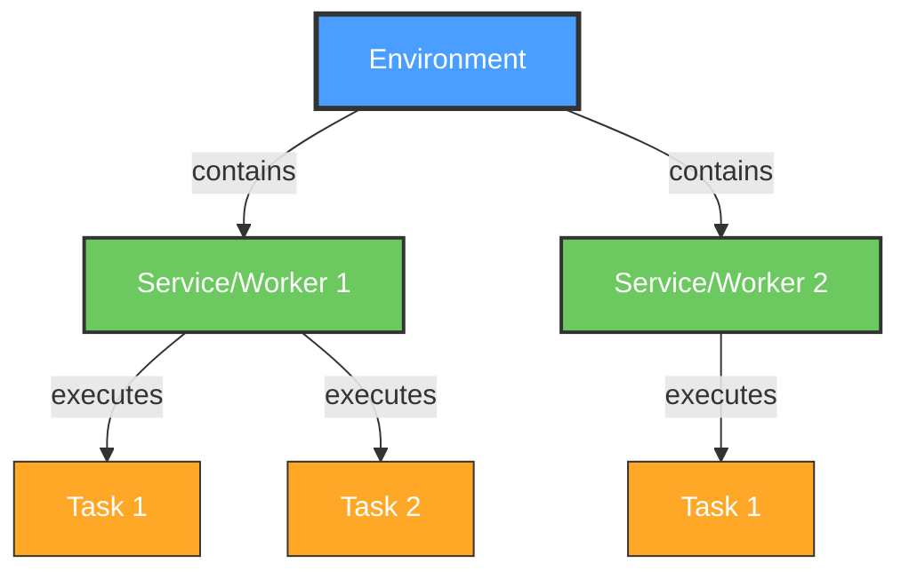

# Fiji and Python

## Scripting, Environments, and Deep Learning Integration

Curtis Rueden @ UW-Madison LOCI  
I2K×BINA 2026

<div class="pt-12">
  <span @click="$slidev.nav.next" class="px-2 py-1 rounded cursor-pointer" hover="bg-white bg-opacity-10" style="font-size: 2em">
    Press <kbd style="font-size: 1em">Space</kbd> to begin <carbon:arrow-right class="inline"/>
  </span>
</div>

<div class="pt-12 text-sm opacity-75">

**SLIDES:** `https://fiji.github.io/i2k-2026-fiji-python/`

</div>

<!--
AGENDA / TIMING (120 min):
- 0:00–0:25  Five steps toward simplicity (talk)
- 0:25–0:35  What's new in Appose
- 0:35–0:50  Demos: Appose in the wild
- 0:50–1:30  Hands-on: StarDist 2D (Cellcast) as an appose-python script
- 1:30–1:52  One more step: scikit-ops
- 1:52–2:00  Which approach when? + Q&A
-->

---
layout: default
---

# Today's Plan

<div class="grid grid-cols-2 gap-8">
<div>

| | |
|---|---|
| **0:00** | Five steps toward simplicity |
| **0:25** | What's new in Appose |
| **0:35** | Demos: Appose in the wild |
| **0:50** | 👩‍💻 Hands-on: a Python-powered Fiji script |
| **1:30** | One more step: scikit-ops |
| **1:52** | Which approach when? Q&A |

</div>
<div>

<v-click>

**To follow along with the hands-on:**
- Fiji **Latest** (not Stable) from https://fiji.sc/
- *Help › Update...* until fully up to date
- [pixi](https://pixi.sh/latest/installation/) (recommended)
- git (recommended)

**Can follow along without coding&mdash;just watch!**

</v-click>

</div>
</div>

---
layout: default
---

# The Problem

<div class="grid grid-cols-2 gap-8">
<div>

### Innovation happens in Python 🐍

- Cellpose, StarDist, SAM, Trackastra, nnInteractive...
- PyTorch, TensorFlow, JAX
- New tools every week

</div>
<div>

### Biologists work in Fiji 🔬

- Established, familiar workflows
- Point-and-click, macros, scripts
- Huge plugin ecosystem

</div>
</div>

<v-click>

<div class="pt-8">

### And every Python tool wants its *own* environment 😱

```
cellpose 3   → torch 2.x, numpy 2.x, python 3.10+
stardist     → tensorflow <2.16, numpy <2, python 3.9–3.11
UNSEG        → python 3.9, numpy 1.24.3, scikit-image 0.20.0
```

</div>

</v-click>

---
layout: center
class: text-center
---

# Five Steps Toward Simplicity

How do we get Python into Fiji, and make it *easy*?

---
layout: two-cols
---

# ① Do It Yourself

Fiji has always been able to *launch* Python...

```groovy
#@ ImagePlus imp
import ij.IJ

// Save the image to disk.
input = File.createTempFile("in", ".tif")
IJ.saveAsTiff(imp, input.path)
output = new File(input.parent, "out.tif")

// Run Python in some environment... somewhere.
pb = new ProcessBuilder(
  "/home/me/miniforge3/envs/seg/bin/python",
  "/home/me/scripts/segment.py",
  input.path, output.path)
pb.inheritIO()
pb.start().waitFor()

// Read the result back from disk.
IJ.openImage(output.path).show()
```

::right::

<div class="pl-8 pt-16">

<v-clicks>

### Cons ❌
- **User** must install Python + all dependencies
- Hardcoded paths everywhere
- Data copied through the filesystem
- No progress, no cancelation, errors = exit codes
- Doesn't travel to another computer

### Pros ✅
- Works! (Sort of.)
- Environments are isolated 🤔

</v-clicks>

</div>

---
layout: two-cols
---

# ② Python Mode

Real CPython *inside* Fiji's process 🐍

Powered by **PyImageJ**, **scyjava** (JPype), and **Jaunch**

*Edit › Options › Python...*  
→ choose/build an environment → restart

```python
#@ ImageJ ij
#@ Dataset image
#@ double sigma
#@output Dataset blurred

from skimage.filters import gaussian

arr = ij.py.from_java(image)  # no copy!
blurred = ij.py.to_dataset(gaussian(arr, sigma))
```

::right::

<div class="pl-8 pt-16">

<v-clicks>

### Pros ✅
- **Same process**: Java and Python share memory
- Full Fiji/ImageJ API from Python
- Interactive, low latency, no serialization

### Cons ❌
- **One environment** at a time, chosen by the user
- All Python libraries must coexist in one env
- A crash in native code takes down Fiji
- macOS threading model restricts GUI scenarios

</v-clicks>

</div>

<!--
Emphasize: this is not obsoleted by what follows. It's a different animal.
We'll come back to "which one when" at the end.
-->

---
layout: default
---

# ③ Appose

## "Interprocess cooperation with shared memory"

<v-clicks>

- 🔄 **Interprocess** - Multiple processes connected via a communication protocol
- 🤝 **Cooperation** - Build environments, start services, run tasks
- 💾 **Shared Memory** - Cross-platform, cross-language memory buffers

</v-clicks>

<v-click>

<div class="pt-6">

Java ↔ Python, Python ↔ Python, Java ↔ Groovy, ... **each tool in its own environment**, all at once.

Environments via **pixi**, **uv**, or **micromamba**&mdash;downloaded and built on demand.
**User doesn't need to know any of them exist.**

</div>

</v-click>

<div class="pt-6 text-sm opacity-75">

https://apposed.org &nbsp;·&nbsp; Deep dive: [I2K 2025 Appose workshop](https://fiji.github.io/i2k-2025-appose/)

</div>

---
layout: default
---

# Appose: Environment → Service → Task

<div class="absolute right-10" style="top: 8rem; width: 22rem;">



</div>

<div style="width: 55%">

```java
// 1. Build the environment (first time only).
Environment env = Appose.file("pixi.toml")
    .subscribeProgress((title, cur, max) -> ...)
    .build();

// 2. Start a worker process in it.
try (Service python = env.python()) {

    // 3. Run a task: inputs in, outputs out.
    Map<String, Object> inputs = Map.of(
        "image", ShmImg.copyOf(img).ndArray());
    Task task = python.task(script, inputs)
        .listen(e -> log(e.message))
        .waitFor();

    Img<?> labels = NDArrays.asArrayImg(
        (NDArray) task.outputs.get("labels"));
}
```

</div>

---
layout: default
---

# Shared Memory: No Copying Big Images

`NDArray` = named `SharedMemory` block + dtype + shape

<div class="grid grid-cols-2 gap-4 pt-4">
<div>

### Python: NumPy-compatible

```python
import appose

data = appose.NDArray("uint16", [2, 20, 25])
arr = data.ndarray()  # numpy view, no copy
```

</div>
<div>

### Java: ImgLib2-compatible

```java
import net.imglib2.appose.*;

// View an NDArray from Python as an Img.
ShmImg<FloatType> img = new ShmImg<>(ndarray);

// Or put an existing Img into shared memory.
Img<FloatType> shared = ShmImg.copyOf(someImg);
```

</div>
</div>

<v-click>

<div class="pt-6">

**Result:** Both processes see *the same pixels*&mdash;only the metadata travels as JSON.

</div>

</v-click>

---
layout: default
---

# In-Process vs. Interprocess: Complementary!

<div class="text-sm">

| | **Python mode** (in-process) | **Appose** (interprocess) |
|---|---|---|
| Environments | One, chosen by user | Many, isolated, built on demand |
| Incompatible tools together | ❌ | ✅ |
| Access to Java objects | ✅ Direct, full API | ⚠️ Via serialization or proxies |
| Data sharing | ✅ Anything, zero-copy | ✅ Arrays zero-copy; rest as JSON |
| Crash isolation | ❌ Crash takes down Fiji | ✅ Worker dies, Fiji lives |
| Cancelation | ⚠️ Cooperative only | ✅ Cooperative, or kill the worker |
| Startup cost | ✅ None after launch | ⚠️ Worker process start (+ first build) |
| Best for | **Interactive** scripting against the ImageJ API | **Shipping** Python tools to users |

</div>

<v-click>

<div class="pt-4">

Python mode is **not obsolete**. It's a different animal: use the right one for the job. 🐘 ≠ 🐙

</div>

</v-click>

---
layout: two-cols
---

# ③ Appose, in Practice

Appose-powered Fiji plugins, written in Java:

- **SAMJ**: Segment Anything, one click
- **TrackMate**: deep learning detectors
- **Mastodon**: Cellpose + Trackastra
- **Appose Playground** *(new!)*: Cellpose, DeXtrusion, nnInteractive, Big-FISH

<v-click>

<div class="pt-4">

But look at what a plugin author writes:
- Java code to build the env
- Java code to marshal inputs/outputs
- Java code to start/stop services
- Python code adapted to Appose's `task`
- ...*plus* the actual algorithm

</div>

</v-click>

::right::

<v-click>

<div class="pl-8 pt-16">

### Consolidating the boilerplate 🧹

Since the Pasteur hackathon (Mar 2026), we're pulling the shared plumbing out of each plugin:

- `imglib2-appose`: Img ↔ NDArray
- Common environment building & progress UI
- **appose-swing** *(coming soon)*: graphical environment manager

**But what if there were *no* Java at all?** 🤔

</div>

</v-click>

---
layout: two-cols
---

# ④ appose-python Scripts

Write **pure Python** in Fiji's Script Editor

```python
#!appose-python
#@script(env="pixi.toml")

#@ Img image
#@ double sigma
#@output Img blurred

from scipy.ndimage import gaussian_filter

print(f"Blurring image of shape {image.shape}")
blurred = gaussian_filter(image, sigma)
```

<div class="pt-2 text-sm">

Env file: `pixi.toml`, `environment.yml`,<br>`requirements.txt`, or `pyproject.toml`

</div>

::right::

<div class="pl-8 pt-16">

<v-clicks>

- `#!appose-python` → CPython via Appose (not Jython!)
- `#@script(env=...)` → Appose builds the env on first run, reuses it after
- `#@` parameters → the usual Fiji dialog, macro recording, batch mode
- Images arrive as **NumPy arrays** via shared memory
- Output NumPy arrays go back to Fiji as images
- `print` goes to the Script Editor console
- Tracebacks point at **your** line numbers

</v-clicks>

<v-click>

**Zero lines of Java.** 🎉

</v-click>

</div>

---
layout: two-cols
---

# ⑤ scikit-ops

A standard, type-annotated Python **function** + one decorator

```python
from skop import op
from skop.types import ImageData, LabelsData

@op(env="skimage")
def otsu(
    image: ImageData,
    invert: bool = False,
) -> LabelsData:
    """Threshold an image by Otsu's method."""
    from skimage import filters, measure

    t = filters.threshold_otsu(image)
    mask = image <= t if invert else image > t
    return measure.label(mask)
```

::right::

<div class="pl-8 pt-16">

<v-clicks>

- **No platform** in the code: no Fiji, no napari
- Types → GUI widgets; docstring → tooltips
- `ImageData`, `LabelsData`, ... → *roles*: each front end shows them its own way
- `env=` → named environment, built on demand, shared between ops

</v-clicks>

<v-click>

### Run it anywhere, as is

- **Directly**: `otsu(my_array)`
- **Isolated**: `skop.Runner().run(otsu, image=a)`
- **napari**: *Plugins › scikit-ops › Ops*
- **Fiji**: *Plugins › scikit-ops › Threshold › Otsu*
- **Icy**: planned

</v-click>

</div>

<!--
Started at the naPLari hackathon in Krakow, July 2026, with Brian Northan.
TODO: Adjust Fiji bullet depending on skop-fiji release status.
-->

---
layout: default
---

# The Staircase, Revisited

<div class="grid grid-cols-5 gap-2 pt-8 text-center text-sm">

<div class="p-3 rounded" style="background: rgba(255,255,255,0.05); margin-top: 8rem">

**1. DIY**<br>
ProcessBuilder<br>
*you do everything*

</div>
<div class="p-3 rounded" style="background: rgba(255,255,255,0.08); margin-top: 6rem">

**2. Python mode**<br>
one process<br>
*one environment*

</div>
<div class="p-3 rounded" style="background: rgba(255,255,255,0.11); margin-top: 4rem">

**3. Appose plugins**<br>
many environments<br>
*Java + Python*

</div>
<div class="p-3 rounded" style="background: rgba(255,255,255,0.14); margin-top: 2rem">

**4. appose-python**<br>
many environments<br>
*pure Python script*

</div>
<div class="p-3 rounded" style="background: rgba(255,255,255,0.17)">

**5. scikit-ops**<br>
many environments<br>
*pure Python function,<br>any platform*

</div>

</div>

<div class="pt-8 text-center">

Today's hands-on climbs from **③ → ④**, then peeks at **⑤**. 🧗

</div>

---
layout: center
class: text-center
---

# What's New in Appose

Since I2K 2025

---
layout: default
---

# Releases

<div class="grid grid-cols-2 gap-8">
<div>

### appose-java

| Version | Date |
|---|---|
| 0.10.0 | Feb 2026 |
| 0.11.0 | Mar 2026 |
| 0.12.0 | *Sep 2026* |

</div>
<div>

### appose-python

| Version | Date |
|---|---|
| 0.10.0 | Feb 2026 |
| 0.11.0 | Mar 2026 |
| 0.12.0 | Jul 2026 |

</div>
</div>

<v-click>

<div class="pt-6">

**Java and Python APIs now aligned** method-for-method: learn one, you know the other.

</div>

</v-click>

<!--
TODO: Confirm appose-java 0.12.0 release date (required by scripting-appose-python).
-->

---
layout: default
---

# Better Feedback While Building Environments

<div class="grid grid-cols-2 gap-8">
<div>

<v-clicks>

- **Real progress** from pixi installs, with real denominators
- Phases: *Solving* → *Installing conda packages* → *Downloading/Installing PyPI packages* → *Done*
- **Skips redundant rebuilds**: unchanged env = instant start
- `APPOSE_ENVS_DIR` to put environments wherever you like
- **Named pixi environments**: one `pixi.toml`, several envs (e.g. `cpu` / `cuda`)
- Build from any source: `Appose.file(...)`, `.url(...)`, `.content(...)`, with format auto-detected

</v-clicks>

</div>
<div>

<v-click>

```java
Environment env = Appose.file("pixi.toml")
    .subscribeProgress((title, cur, max) ->
        status.showStatus(cur, max, title))
    .subscribeOutput(System.out::print)
    .subscribeError(System.err::print)
    .build();

// Pick a named pixi environment.
Environment gpu = env.activate("cuda");
```

</v-click>

</div>
</div>

---
layout: default
---

# More Robust Tasks

<div class="grid grid-cols-2 gap-8">
<div>

### Execution & cancelation

<v-clicks>

- Interrupting the calling thread **shuts down** the worker cleanly
- `Task.waitFor()` **throws** `TaskException` on failure: no silent errors
- Fixed race conditions around worker thread death
- Cleaner worker processes: stray conda/mamba activation variables stripped
- Windows fixes: paths with parentheses, exec handling

</v-clicks>

</div>
<div>

### Beyond primitives

<v-clicks>

- **Automatic proxies** for non-serializable outputs: call methods on remote Python objects from Java
- **Extensible encoding/decoding**: teach Appose your own types
- Pass alternate arguments to the Python service

</v-clicks>

<v-click>

```java
WorkerObject model = (WorkerObject)
    task.outputs.get("model");
model.call("eval");
```

</v-click>

</div>
</div>

---
layout: center
class: text-center
---

# Demos: Appose in the Wild

---
layout: default
---

# Appose-Powered Fiji Plugins

<div class="grid grid-cols-3 gap-6 pt-4">

<div>


### SAMJ
Segment Anything, one click

*Manage Update Sites › SAMJ*

</div>
<div>


### TrackMate
Deep learning spot detectors

[v9-appose branch](https://github.com/trackmate-sc/TrackMate/tree/v9-appose)

</div>
<div>


### Mastodon
Cellpose3 + Trackastra lineages

*Manage Update Sites › Mastodon-DeepLineage*

</div>
</div>

<div class="pt-8 text-sm opacity-75">

Full demo walkthroughs: [I2K 2025 Appose workshop](https://fiji.github.io/i2k-2025-appose/)

</div>

<!--
TODO: Check current TrackMate appose status (still v9-appose branch?).
Keep this brief: ~5 min total. The abstract promises these.
-->

---
layout: default
---

# New: Appose Playground 🎪

Fruits of the **Appose hackathon at Institut Pasteur** (Mar 2026)

*Help › Update... › Manage Update Sites › Appose-Playground*

<div class="grid grid-cols-2 gap-6 pt-4">
<div>

### Fiji-Cellpose
Cell/nuclei segmentation with Cellpose

### DeXtrusion
Detect cellular events in epithelia movies

</div>
<div>

### nnInterAppose
Semi-automatic 3D segmentation from manual prompts, with nnInteractive

### Big-FISH
smFISH spot detection

</div>
</div>

<div class="pt-6 text-sm opacity-75">

https://github.com/Image-Analysis-Hub#appose-playground

</div>

<!--
TODO: Pick 1–2 of these for live demo; pre-build envs on the demo machine!
TODO: Verify Big-FISH description (BigFish_Appose on update site, not yet listed on GitHub page).
-->

---
layout: center
class: text-center
---

# 👩‍💻 Hands-On 👨‍💻

**StarDist in Fiji, the 2026 way**

<div class="pt-4">
Goal: Build a StarDist 2D Fiji command, from scratch, as an appose-python script
</div>

<div class="pt-8 text-sm opacity-75">
⏱️ ~30 minutes
</div>

---
layout: default
---

# Workshop Overview

<div class="grid grid-cols-2 gap-8">
<div>

## What we'll build

A Fiji command that runs **StarDist 2D** nucleus segmentation, powered by **Cellcast**

<v-click>

**Cellcast:** a *recast* of cell segmentation models  
by Ed Evans @ LOCI · https://github.com/uw-loci/cellcast

- Written in **Rust**, on the Burn deep learning framework
- **WebGPU** backend: any GPU (Metal, Vulkan, DirectX), or CPU
- `pip install cellcast`: needs only **NumPy**

</v-click>

</div>
<div>

<v-click>

## Why Cellcast?

- No TensorFlow, no CUDA: no multi-GB download over conference Wi-Fi
- GPU-accelerated on *your* laptop, whatever its GPU
- Pretrained *versatile fluo* weights: no training needed

</v-click>

<v-click>

<div class="pt-4 text-sm">

**Last year** we did UNSEG, via Groovy + the Appose API ([slides](https://fiji.github.io/i2k-2025-appose/), [code](https://github.com/ctrueden/unseg-fiji)).<br>**This year:** pure Python. No Java, no Groovy.

</div>

</v-click>

</div>
</div>

---
layout: default
---

# Step 0: Set Up

Create an empty project folder:

```bash
mkdir ~/Desktop/stardist-fiji
cd ~/Desktop/stardist-fiji
```

<v-click>

That's it. No cloning, no downloads (yet). We'll build everything **from scratch**. 🏗️

</v-click>

<v-click>

**You'll need:**
- **Fiji**, fully updated (*Help › Update...*)
- **pixi**, for testing on the command line: https://pixi.sh

</v-click>

<!--
TODO: Push a reference solution with per-step checkpoints (e.g. ctrueden/stardist-fiji,
tags step-01 ... step-09) and add a "Stuck?" link to this slide.
-->

---
layout: two-cols
---

# Step 1: The Environment

Build a pixi environment, one command at a time:

```bash
pixi init
pixi add python=3.12 appose
pixi add --pypi cellcast
```

<v-click>

Result: `pixi.toml`

```toml
[workspace]
channels = ["conda-forge"]
name = "stardist-fiji"
platforms = ["osx-arm64"]
version = "0.1.0"

[dependencies]
python = "3.12.*"
appose = ">=0.12.0,<0.13"

[pypi-dependencies]
cellcast = ">=0.3.0, <0.4"
```

</v-click>

::right::

<div class="pl-8 pt-16">

<v-clicks>

- `appose` comes from **conda-forge**: the worker needs it to talk to Fiji
- `cellcast` is only on **PyPI**: hence `--pypi`
- PyPI packages need a Python first: add `python` *before* `cellcast`
- NumPy? Comes along with `cellcast`

</v-clicks>

<v-click>

💡 `pixi init` lists only **your** platform. To share the env with others:

```bash
pixi workspace platform add \
  linux-64 linux-aarch64 \
  osx-64 osx-arm64 win-64
```

</v-click>

</div>

---
layout: two-cols
---

# Step 2: Quick Test in Python REPL

Before touching Fiji, make sure it works:

```python
$ pixi run python
>>> import cellcast
>>> model = cellcast.models.StarDist2D.init_fluo(gpu=True)
>>> help(model.predict_fluo)
```

<v-click>

Segment a fake image with two square "nuclei":

```python
>>> import numpy
>>> image = numpy.zeros((256, 256), dtype=numpy.uint16)
>>> image[50:90, 50:90] = 1000
>>> image[150:200, 140:180] = 1000
>>> labels = model.predict_fluo(image)
>>> labels.max()
np.uint64(2)
```

</v-click>

::right::

<div class="pl-8 pt-16">

<v-clicks>

- First `init_fluo` **downloads** the pretrained weights, then caches them
- `gpu=True` → WebGPU; `gpu=False` → CPU
- `help()` shows the knobs: `pmin`, `pmax`, `prob_threshold`, `nms_threshold`
- Output: a **label image**, one integer per nucleus
- Note the dtype: `uint64` 👀 (remember this for later)

</v-clicks>

<v-click>

🎯 **Debug strategy:** always get it working in plain Python *first*. Then move to Fiji.

</v-click>

</div>

---
layout: two-cols
---

# Step 3: Acquire Sample Data

Download scikit-image's `cells3d` dataset:

```bash
curl -LO https://gitlab.com/scikit-image/data/-/raw/\
2cdc5ce89b334d28f06a58c9f0ca21aa6992a5ba/cells3d.tif
```

<div class="text-sm opacity-75">

Windows PowerShell: `curl.exe` (not `curl`), all on one line

</div>

<v-click>

Or skip the terminal: in Fiji, *File › Import › URL...*

</v-click>

::right::

<div class="pl-8 pt-16">

<v-click>

Open `cells3d.tif` in Fiji:
- 256×256 pixels, **60** Z slices, **2** channels, 16-bit
- C1 = membranes, C2 = **nuclei** 🎯
- Courtesy of the Allen Institute for Cell Science

</v-click>

<v-click>

Keep just the nuclei:
1. *Image › Color › Split Channels*
2. Close `C1-cells3d.tif`

</v-click>

<v-click>

And make a 2D test image:

3. On `C2-cells3d.tif`, go to slice 30
4. *Image › Duplicate...*, **uncheck** *Duplicate stack*

</v-click>

</div>

<!--
Alternative, if the URL is ever dead: `pixi add scikit-image pooch`, then
skimage.data.cells3d() and tifffile.imwrite(..., imagej=True). The URL is the
one pinned in skimage/data/_registry.py.
-->

---
layout: two-cols
---

# Step 4: Hello, Script!

In Fiji: *File › New › Script...*

Paste or type the following:

```python
#@script(language="appose-python", env="pixi.toml")

#@ Img image

print(f"shape={image.shape}, dtype={image.dtype}")
```

**Save it** to your project folder as `Cellcast_via_Appose.py`.

Select the `C2-cells3d.tif` window, then click **Run** ▶️

::right::

<div class="pl-8 pt-16">

<v-clicks>

- First run **builds the environment**: watch the status bar ⏳
- Same `pixi.toml` we tested from the command line
- Output appears in the Script Editor console
- Run again: instant, env is reused

</v-clicks>

<v-click>

**🤔 What shape did you get?**

```
shape=(60, 256, 256), dtype=uint16
```

Z first! NumPy axes are **reversed** from ImgLib2's: (X, Y, Z) → (Z, Y, X)

</v-click>

</div>

<!--
TODO: Verify actual shape/dtype printed for C2-cells3d.tif.
-->

---
layout: two-cols
---

# Step 5: Segment!

Add an output, and the same two lines we ran in the REPL:

```python {4,6-9}
#@script(language="appose-python", env="pixi.toml")

#@ Img image
#@output Img labels

import cellcast

model = cellcast.models.StarDist2D.init_fluo(gpu=True)
labels = model.predict_fluo(image).astype("uint16")
```

Select the **2D slice** window, then **Run** ▶️

::right::

<div class="pl-8 pt-16">

<v-clicks>

- `#@output Img labels` → the `labels` variable comes back as a new image
- `.astype("uint16")`: remember that `uint64`? Fiji prefers 16-bit labels
- *Image › Lookup Tables › glasbey_on_dark* to see the nuclei 🌈
- Weights are cached: no download this time

</v-clicks>

<v-click>

🎉 **StarDist in Fiji.** Nine lines, zero Java.

</v-click>

</div>

<!--
TODO: Verify how the output image is displayed (window title, calibration).
-->

---
layout: two-cols
---

# Step 6: Expose the Parameters

```python
#@ Img image
#@ Double (value=1.0) pmin
#@ Double (value=99.8) pmax
#@ Double (value=0.479, min=0, max=1) prob_threshold
#@ Double (value=0.3, min=0, max=1) nms_threshold
#@ Boolean (value=true) gpu
#@output Img labels
```

```python
model = cellcast.models.StarDist2D.init_fluo(gpu=gpu)
labels = model.predict_fluo(
    data=image,
    pmin=pmin,
    pmax=pmax,
    prob_threshold=prob_threshold,
    nms_threshold=nms_threshold,
).astype("uint16")
```

::right::

<div class="pl-8 pt-16">

<v-clicks>

- Standard [SciJava script parameters](https://imagej.net/scripting/parameters)
- Where did the defaults come from? `help(model.predict_fluo)` 📖
- Numbers, strings, booleans → plain Python values
- Fiji builds the dialog for you
- Add `description="..."` for tooltips
- Macro-recordable, headless-runnable, batch-able

</v-clicks>

<v-click>

**🎯 Try:** lower `prob_threshold` → more nuclei; raise `nms_threshold` → more overlap allowed

</v-click>

</div>

---
layout: two-cols
---

# Step 7: Go 3D

Now select `C2-cells3d.tif` (the whole stack) and **Run** ▶️

<v-click>

```
TypeError: Unsupported array dtype, supported array
dtypes are u8, u16, u64, f32, and f64.
```

🤨 But it *is* `uint16`! The real problem: StarDist**2D** wants a **2D** array.

</v-click>

<v-click>

**Fix:** segment slice by slice.

</v-click>

::right::

<v-click>

<div class="pl-4">

```python {all|4-11|12-13|14-20|21-22}
import numpy

model = cellcast.models.StarDist2D.init_fluo(gpu=gpu)
def stardist2d(plane):
    return model.predict_fluo(
        data=plane,
        pmin=pmin,
        pmax=pmax,
        prob_threshold=prob_threshold,
        nms_threshold=nms_threshold,
    ).astype("uint16")
if image.ndim == 2:
    labels = stardist2d(image)
elif image.ndim == 3:
    slice_count = image.shape[0]
    label_slices = []
    for i in range(slice_count):
        task.update(f"Slice {i + 1} of {slice_count}",
                    current=i, maximum=slice_count)
        label_slices.append(stardist2d(image[i]))
    labels = numpy.stack(label_slices)
else:
    raise ValueError(f"Bad shape: {image.shape}")
```

</div>

</v-click>

<!--
- `task` is always available: task.update(...) → progress in Fiji's status bar.
- Init the model ONCE, outside the loop (the template re-inits per slice).
- Label IDs restart at 1 on each slice: not linked across Z. Bonus challenge:
  cellcast also has cellcast.models.StarDist3D!
- task.cancel_requested → honor the Cancel button inside the loop (bonus).
-->

---
layout: two-cols
---

# Step 8: One File to Rule Them All

Move the environment **into the script** with a [PEP 723](https://packaging.python.org/en/latest/specifications/inline-script-metadata/) block, then delete `pixi.toml`:

```python {1-9}
#@script(language="appose-python")

# /// script
# requires-python = ">=3.12,<3.13"
# dependencies = [
#   "cellcast>=0.3.0,<0.4",
#   "appose>=0.12.0,<0.13",
# ]
# ///

#@ Img image
#@output Img labels
...
```

::right::

<div class="pl-8 pt-16">

<v-clicks>

- No more `env=`: the script *is* the environment declaration
- `dependencies` come from **PyPI**, so `appose` does too
- Need conda packages? `[tool.pixi.dependencies]` works too
- Platforms: automatic, whatever the script runs on
- Same standard as `uv run` and `pixi run --script`

</v-clicks>

<v-click>

**Why bother?** One file is **much** easier to share. 📦

</v-click>

</div>

<!--
Workflow tip: keep pixi.toml while developing (easy REPL testing with
`pixi run python`), then go inline once it works.
-->

---
layout: default
---

# Step 9: Make It a Menu Command

Copy the script into Fiji's `scripts` directory:

```
Fiji.app/scripts/Plugins/StarDist/
└── Cellcast_via_Appose.py
```

<v-clicks>

- Restart Fiji → *Plugins › StarDist › Cellcast via Appose*
- Also appears in the **search bar** 🔍
- One file, environment included: nothing else to copy
- Share it on an **update site**: users get the plugin, Appose builds the env

</v-clicks>

<v-click>

<div class="pt-4">

### That's it. 🎉 A GPU-accelerated deep learning Fiji plugin with **zero Java**.

</div>

</v-click>

---
layout: two-cols
---

# Recap: What We Built

<div class="text-sm">

1. `pixi init` + `pixi add`: an environment
2. `pixi run python`: test Cellcast standalone
3. `curl`: sample data
4. `#@script` + `#@ Img`: hello, Fiji
5. `predict_fluo`: segment one slice
6. `#@` parameters: a dialog for free
7. A `for` loop: handle 3D stacks
8. `/// script`: one self-contained file
9. `scripts/Plugins/`: a menu command

</div>

<v-click>

<div class="pt-4">

Compare I2K 2025: **~100 lines of Groovy** + edits to UNSEG's own code

</div>

</v-click>

::right::

<div class="pl-8 pt-16">

<v-click>

### Psst... 🤫

It ships with Fiji now, as a **script template**:

*File › New › Script...*  
*Templates › Appose › StarDist cellcast*

</v-click>

<v-click>

Nearly identical to what you just wrote. Compare! 🔍

</v-click>

</div>

<!--
TODO: Verify the template's menu path in the Script Editor once
scripting-appose-python 0.1.0 is on the update site.
-->

---
layout: default
---

# Troubleshooting Tips

<div class="text-sm">

<v-clicks>

- **Environment build fails** → Test on the command line: `pixi install`, then `pixi run python -c "import cellcast"`
- **`ModuleNotFoundError: appose`** → The env needs the `appose` package (and `numpy` for images)
- **`pixi add cellcast` finds nothing** → It's on PyPI, not conda-forge: `pixi add --pypi cellcast`
- **Wrong language** → First line must be `#@script(language="appose-python", ...)` or `#!appose-python`, or Fiji will use Jython
- **Env file not found** → `env=` is relative to the *script's* location: save the script first!
- **`Unsupported array dtype`** on a stack → StarDist2D wants 2D: loop over slices (Step 7)
- **Labels look black** → Apply a LUT (*glasbey_on_dark*), or *Image › Adjust › Brightness/Contrast*
- **Axes look wrong** → NumPy order is reversed from Fiji's: `(Z, Y, X)`, not `(X, Y, Z)`
- **See what the worker is doing** → *Window › Console*, and set log level to debug

</v-clicks>

<v-click>

**Debug strategy:** ① test Python standalone (`pixi run python`) → ② test the script with a trivial body (`print(image.shape)`) → ③ add the real work incrementally

</v-click>

</div>

---
layout: center
class: text-center
---

# One More Step: scikit-ops

What if the **same Python** ran in Fiji, *and* napari, *and* notebooks...?

---
layout: default
---

# From Script to Op

<div class="grid grid-cols-2 gap-8">
<div>

StarDist 2D is already a scikit-ops op:

```python
@op(env="stardist-tf")
def stardist2d_fluo(
    image: Annotated[ImageData, Axes("y", "x", "c?")],
    prob_thresh: float = 0.5,
    nms_thresh: float = 0.4,
    normalize: bool = True,
) -> LabelsData:
    """Detect objects in a fluorescence image
    with pretrained StarDist."""
    ...
```

</div>
<div>

<v-click>

**Compare with our script:**

<div class="text-sm">

| Script | Op |
|---|---|
| `#@script(env=...)` | `@op(env=...)` |
| `#@ Double (value=0.3) t` | `t: float = 0.3` |
| `#@output Img labels` | `-> LabelsData` |
| our `for` loop | axis mapping |
| `task.update(...)` | `skop.progress(...)` |

</div>

</v-click>

<v-click>

Same idea, but it's **just a Python function**: testable, callable, no platform baked in.

</v-click>

</div>
</div>

<!--
Remember our 3D loop? The op declares 2D, and the front end does the looping.

Note: skop's stardist2d ops use the original TensorFlow StarDist (stardist-tf env),
not Cellcast. (Signature abridged: the real one has slider widget hints.)
-->

---
layout: default
---

# Demo: scikit-ops in napari 🏝️

`skop-napari`: one **Ops** panel for *every* op skop can discover

<div class="grid grid-cols-2 gap-8 pt-4">
<div>

<v-clicks>

- Form generated from the op's signature
- Image/labels parameters → layer pickers
- Outputs → the right layer type, by role
- Progress bar + Cancel button
- Environment build progress, too
- **Axis mapping**: run a 2D op slicewise on a 3D stack

</v-clicks>

</div>
<div>

<v-click>

### The demo 🤯

One 3D dataset, one napari:
1. **StarDist 2D** slicewise (TensorFlow env)
2. **Cellpose 3** slicewise (PyTorch env)
3. **UNSEG** (Python 3.9 env)

Three incompatible environments,<br>side by side, zero setup.

</v-click>

</div>
</div>

<!--
TODO: Pre-build stardist-tf, cellpose3, unseg-cv envs on the demo machine.
TODO: Pick the 3D dataset (skop.ops.generate:synthetic_nuclei? or a real one).
-->

---
layout: default
---

# Try It Yourself

```bash
pip install skop-napari
napari
```

*Plugins › scikit-ops › Ops*

<v-click>

### Or from plain Python

```python
import skop
from skop.ops.segment import unseg

with skop.Runner() as runner:
    result = runner.run(unseg, image=my_array)

print(result.n_nuclei, result.n_cells)
```

</v-click>

<!--
TODO: Requires scikit-ops 0.1.0 + skop-napari 0.1.0 on PyPI. If not released,
make this slide "coming soon" and demo from a checkout.
-->

---
layout: default
---

# And in Fiji: skop-fiji

<div class="grid grid-cols-2 gap-8">
<div>

<v-clicks>

- **One menu command per op**: *Plugins › scikit-ops › Segment › Unseg*
- Found by the **search bar**
- Dialog generated from the op's signature
- Labels → `ImgLabeling`, boxes/masks → ROI Manager
- Progress & Cancel in the status bar
- Stable macro identifier: macro-recordable
- **Shares environments with napari**: build once, use everywhere

</v-clicks>

</div>
<div>

<v-click>

### Axis mapping, in one line

```
x y z! c
```

- `x`, `y` → fed to the op
- `z!` → iterate: run slicewise
- `z=27` → run at one position
- `z+` → hand the whole axis to the op

</v-click>

</div>
</div>

<!--
TODO: Depends on skop-fiji 0.1.0 + update site. If not ready, retitle
"Coming soon: skop-fiji" and keep brief.
TODO: Verify menu path for the unseg op.
-->

---
layout: default
---

# Which Approach When?

<div class="text-sm">

| You want to... | Use |
|---|---|
| Script interactively against the ImageJ API, from Python | **Python mode** |
| Mix Python and Java objects freely, zero-copy | **Python mode** |
| Use a Python tool with its own (incompatible) environment, from Fiji | **appose-python script** |
| Ship a Python-powered command to Fiji users, no Java | **appose-python script** |
| Build a rich Java UI (TrackMate, Mastodon, SAMJ) around Python models | **Appose** (Java API) |
| Write an algorithm once, for Fiji *and* napari *and* notebooks | **scikit-ops** |

</div>

<v-click>

<div class="pt-6">

They compose, too: an appose-python script, a Java plugin, and an op can all share the **same** Appose environments.

</div>

</v-click>

---
layout: default
---

# Next Steps

<div class="grid grid-cols-2 gap-8">
<div>

**Learn more:**
- Appose: https://apposed.org
- appose-python scripts: https://github.com/scijava/scripting-appose-python
- scikit-ops: https://github.com/apposed/scikit-ops
- Python mode: https://imagej.net/scripting/python
- Appose Playground: https://github.com/Image-Analysis-Hub

</div>
<div>

**Get involved:**
- Forum: https://forum.image.sc (tags: `appose`, `fiji`, `python`)
- Wrap your favorite Python tool as an appose-python script, or an op!
- Contribute back! PRs welcome

</div>
</div>

---
layout: center
class: text-center
---

# Questions?

Thank you for participating! 🙏

<div class="pt-8">
<div>Slides: https://fiji.github.io/i2k-2026-fiji-python/</div>
<div>Cellcast: https://github.com/uw-loci/cellcast</div>
<div>Forum: https://forum.image.sc</div>
</div>
